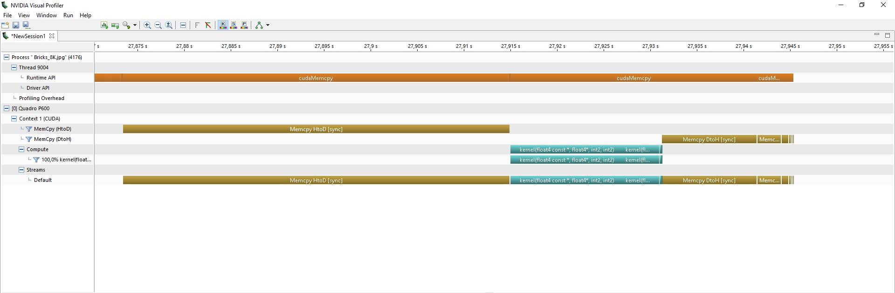
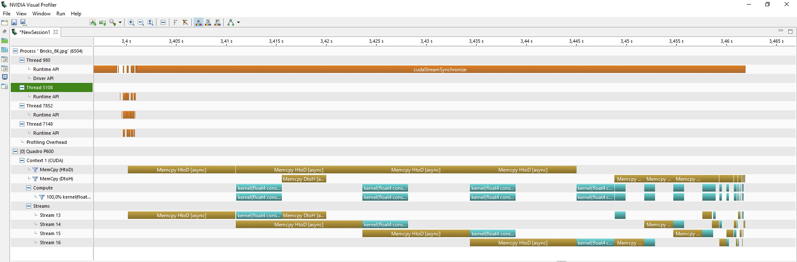

# Generating mipmaps using CUDA
This projects show various ways to compute and
parallelize the mipmap chain creation of an image.

The methods explored are:
- Serial
- OpenMP (CPU threads)
- CUDA (GPU threads)
- OpenMP + CUDA 

### CUDA sync
This method uses the CUDA synchronous functions to generate the mipmaps. This is way faster than 
previous solutions but doesn't allow to overlap memory copies and kernel work. 

### CUDA async + OpenMP
the OpenMP + CUDA method shows how it can be possible to synchronize the GPU when there are more threads that record asynchronous CUDA commands.

The commands to execute the work and copy the images can then be overlapped, while this method is faster
than CUDA sync it requires careful synchronization between streams to work well (synchronization that has been done
with events).

To allow for better overlapping a trick has been applied to the CUDA + OpenMP version. The image
gets split in 4 different bands and copied one band at a time. This allows to better overlap
the copies with the kernels.

In the previous image we can see 4 streams that each copy a band of the image and process it, then
wait for all the other streams to finish and then start the next level of the mip chain.
The resulting images are also transferred to the host memory asynchronously.

